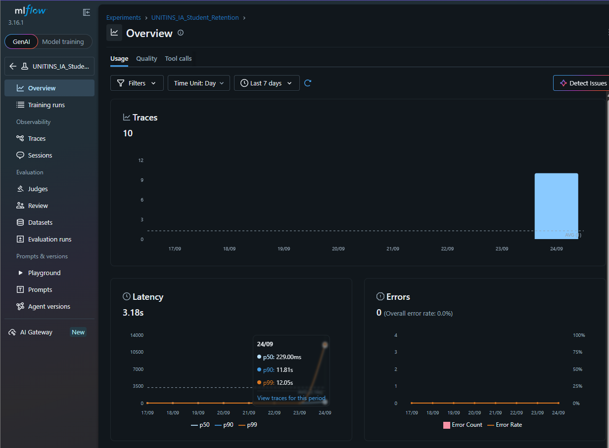

# Atividade Prática Avaliativa de Inteligência Artificial — UNITINS
## Pipeline de MLOps com PyTorch e MLflow: Predição de Evasão Acadêmica


```
=================================================================================================
UNIVERSIDADE ESTADUAL DO TOCANTINS (UNITINS)
Câmpus Universitário de Palmas | Colegiado de Sistemas de Informação
Disciplina: Inteligência Artificial (Período Letivo 2026/1)
Docente: Prof. Me. Marco Antonio Firmino de Sousa
Discente: João Victor Ito
Repositório Oficial de Avaliação Prática
=================================================================================================
```

[](https://www.python.org/)
[](https://pytorch.org/)
[](https://mlflow.org/)
[](https://scikit-learn.org/)
[]()

---

## 1. Visão Geral da Atividade e Situação-Problema (Slide 8)

### 1.1. O Desafio Operacional da Equipe
Em um cenário corporativo e institucional, a equipe de Ciência de Dados vinha desenvolvendo e ajustando modelos conexionistas de forma **estritamente manual e descentralizada**. A ausência de uma esteira estruturada de Engenharia de Machine Learning resultou em graves problemas:
1. **Perda de Contexto e Histórico Experimental:** Não havia registro auditável de quais hiperparâmetros geraram determinados resultados, nem rastreamento de métricas intermediárias calculadas época a época.
2. **Falta de Reprodutibilidade:** Experimentos executados em máquinas distintas não conseguiam replicar as mesmas matrizes de confusão devido à falta de controle determinístico de sementes e separação inconsistente de dados.
3. **Ausência de Governança e Rastreabilidade:** Pesos de modelos treinados eram sobrescritos ou perdidos, e artefatos de pré-processamento (como médias e desvios de normalização) não eram versionados junto ao modelo correspondente.

### 1.2. A Missão MLOps Implementada
A solução desenvolvida nesta avaliação reestrutura todo o ciclo de vida analítico, implementando um pipeline robusto, auditável, modular e completamente observável:
- **Modelagem Conexionista em PyTorch Puro:** Rede Multilayer Perceptron ([`StudentRetentionMLP`](file:///c:/Users/itofr/Documents/Testes/IA-MlFlow/src/model.py#L18)) desenvolvida via `torch.nn.Module` para classificação multiclasse supervisionada em 3 vias (*Dropout*, *Enrolled*, *Graduate*).
- **Dataset Oficial Homologado:** Conjunto de dados *"Predict Students' Dropout and Academic Success"* (4.424 registros, 34 variáveis preditivas) ingerido programaticamente via `kagglehub` com mecanismo de resiliência local.
- **Divisão em 3 Vias Estritas (A Regra de Ouro da UNITINS):** Particionamento determinístico com semente fixa (`SEED=42`) e estratificação em **60% Treino**, **20% Validação** e **20% Teste Reservado** (blindado contra vazamento de dados).
- **Observabilidade Total com MLflow Tracing:** Governança completa de experimentos com registro de parâmetros, curvas por época com *step*, persistência de checkpoints, catalogação de modelos (`mlflow.pytorch.log_model`) e instrumentação de spans distribuídos (`Span_Preparar_Dados`, `Span_Treinamento`, `Span_Validacao_Final`, `Span_Avaliacao_Teste_Reservado`).

---

## 2. Matriz de Critérios de Avaliação e Pesos Oficiais (Slide 15)

O projeto foi rigorosamente estruturado para atender e superar os 4 pilares avaliativos da UNITINS:

| Critério de Avaliação | Peso | Requisito Oficial da Prova | Como Foi Atendido no Projeto |
| :--- | :---: | :--- | :--- |
| **1. Instrumentação de Runs, Métricas, Artefatos e Trace** | **25%** | Rastrear parâmetros, métricas por época, artefatos gerados e implementar Tracing com Spans explícitos. | Instrumentação no [`train_pipeline.py`](file:///c:/Users/itofr/Documents/Testes/IA-MlFlow/src/train_pipeline.py) com 4 Spans via `@mlflow.trace`, métricas época a época com `step=epoch` (`train_loss`, `val_loss`, `val_accuracy`), checkpoint automático de menor perda (`best_model.pt`), empacotamento PyTorch e salvamento de `scaler.pkl` e JSONs. |
| **2. Automação e Reprodutibilidade** | **25%** | Garantir execução com 1 comando, ambiente virtual reprodutível, ingestão automática e semente única. | Ingestão via `kagglehub`, semente única universal (`SEED=42`), particionamento 60/20/20 com estratificação idêntica para as 3 runs e execução com comando único `python src/train_pipeline.py`. |
| **3. Comparação, Escolha e Diagnóstico no Vídeo** | **30%** | Comparar as 3 runs, diagnosticar o incidente de instabilidade e eleger a campeã estritamente pela validação, avaliando no teste uma única vez. | Análise profunda do incidente na Run A ($\eta=0.01$) com curva em "U", confirmação do amortecimento na Run B ($\eta=0.001$), eleição da Campeã pela validação e avaliação cega única no teste reservado ($77,74\%$ de acurácia). |
| **4. Qualidade do Código e Documentação** | **20%** | Código modular limpo (PEP 8), tratamento de erros, documentação técnica aprofundada e roteiro de vídeo. | Separação em `src/dataset.py`, `src/model.py`, `src/train_pipeline.py`, tipagem estática (*type hints*), docstrings completas, pasta `spec/` exaustiva e roteiro de vídeo minuto a minuto. |

---

## 3. Navegação Rápida pela Documentação Técnica (`spec/`)

Para detalhes analíticos, matemáticos e de código, consulte os documentos dedicados da pasta `spec/`:

| Documento de Engenharia | Conteúdo e Detalhamento |
| :--- | :--- |
| 📖 [**`spec/README.md`**](file:///c:/Users/itofr/Documents/Testes/IA-MlFlow/spec/README.md) | **Especificação Mestra Unificada e Guia de Auditoria:** Documento central consolidado contendo a visão holística do projeto: dados, matemática, MLOps, resultados empíricos comparativos e diagnóstico científico completo. |
| 📐 [**`spec/architecture.md`**](file:///c:/Users/itofr/Documents/Testes/IA-MlFlow/spec/architecture.md) | **Modelagem Matemática e Topologia da Rede:** Equações formais do forward pass, cálculo analítico de todos os 4.419 parâmetros treináveis, justificativa da ReLU contra saturação do gradiente, formulação matemática do Dropout Invertido ($p=0.2$), entropia cruzada com LogSumExp e conexões com Russell & Norvig e Cybenko. |
| 🛠️ [**`spec/implementation.md`**](file:///c:/Users/itofr/Documents/Testes/IA-MlFlow/spec/implementation.md) | **Engenharia de Software e MLOps:** Arquitetura do repositório, ingestão resiliente via `kagglehub`, particionamento em 3 vias estritas (60/20/20 estratificado), prevenção matemática de Data Leakage no `StandardScaler`, e os 4 Retratos de Observabilidade do MLflow com Tracing. |
| 📊 [**`spec/results.md`**](file:///c:/Users/itofr/Documents/Testes/IA-MlFlow/spec/results.md) | **Caderno Experimental e Diagnóstico:** Tabela comparativa oficial das 3 Runs com dados extraídos do MLflow, análise do incidente e curva em "U" na Run A, confirmação da convergência suave na Run B, matriz de confusão e relatório final no teste não visto. |

---

## 4. Quadro Comparativo das 3 Runs e Modelo Campeão

Todas as 3 configurações obrigatórias (Slide 10) foram executadas sob a mesma semente (`SEED=42`), 60 épocas e tamanho de lote (`batch_size=32`):

```
========================================================================================================
QUADRO COMPARATIVO DAS 3 CONFIGURAÇÕES EXECUTADAS (MÉTRICAS DA VALIDAÇÃO)
========================================================================================================
Identificador        | Taxa (LR) | Regularização L2 | Melhor Época | Val Loss (Mínima) | Val Accuracy | Val F1-Pond
--------------------------------------------------------------------------------------------------------
Run_A_Referencia     | 0.01      | 0.0              | Época 7      | 0.5875            | 76,61%       | 0.7570
Run_B_Taxa_Menor 🏆  | 0.001     | 0.0              | Época 16     | 0.5649            | 76,84%       | 0.7633
Run_C_Com_L2         | 0.01      | 1e-05            | Época 7      | 0.5683            | 76,38%       | 0.7520
========================================================================================================
```

### 4.1. Resumo do Diagnóstico Científico
- **Incidente na Run A:** A taxa $\eta = 0.01$ gerou passos excessivos na superfície de custo, fazendo com que a perda de validação atingisse o mínimo já na época 7 e depois sofresse sobreajuste (*overfitting*), subindo para $0.8851$ (+50,6%) na época 60.
- **Solução na Run B (Campeã):** A redução da taxa para $\eta = 0.001$ estabilizou a descida do gradiente. A rede alcançou a **menor perda global ($0.5649$)** e **maior acurácia ($76,84\%$)**, estabilizando-se com excelente gap de generalização ($0.2652$).
- **Efeito na Run C:** A penalização $L_2$ ($1\times 10^{-5}$) reduziu a perda mínima para $0.5683$, mas a taxa elevada a fez divergir nas épocas finais, provando que o ajuste da taxa na Run B foi a melhor intervenção técnica.

### 4.2. Desempenho do Modelo Campeão no Teste Reservado (Dados Não Vistos — $N=885$)
Em observância à **Regra de Ouro da UNITINS (Slide 12)**, os pesos da Run B foram submetidos **uma única vez** à partição de teste:
- **Acurácia Global no Teste:** **$77,74\%$** ($688$ acertos em $885$ amostras)
- **F1-Score Ponderado:** **$0.7742$** (F1-Macro: **$0.7251$**)
- **Loss no Teste:** **$0.5820$**
- **Matriz de Confusão:**
  - *Graduados (`Graduate`):* $392$ acertos em $442$ casos (**Sensibilidade de $88,69\%$**).
  - *Evasores (`Dropout`):* $214$ acertos em $284$ casos (**Precisão de $81,99\%$**).
  - *Matriculados (`Enrolled`):* $82$ acertos em $159$ casos (classe transitória intermediária).

---

## 5. Guia Passo a Passo: Execução, Acesso ao MLflow e Comparação Completa dos Painéis

Este guia orienta detalhadamente como executar o projeto, inicializar o servidor de observabilidade do MLflow e navegar pelos painéis, gráficos e links diretos para auditar e comparar todas as métricas e artefatos.

---

### Passo 1: Preparação do Ambiente e Dependências

Abra o terminal na pasta raiz do projeto:
```bash
cd c:\Users\itofr\Documents\Testes\IA-MlFlow
```

Ative o ambiente virtual já configurado no repositório:
- **No Windows (PowerShell):**
  ```powershell
  .\.venv\Scripts\Activate.ps1
  ```
- **No Linux / macOS (Bash):**
  ```bash
  source .venv/bin/activate
  ```

*(Opcional / Verificação)* Caso precise reinstalar ou validar os pacotes:
```bash
pip install -r requirements.txt
```

---

### Passo 2: Executar o Pipeline Completo (Comando Único)

Com o ambiente ativado, dispare o orquestrador principal com um único comando:
```bash
python src/train_pipeline.py
```

#### O que o script executa automaticamente em segundo plano:
1. **Ingestão:** Baixa/carrega o dataset de 4.424 registros e 34 variáveis via `kagglehub`.
2. **Engenharia de Dados:** Aplica a **Regra de Ouro** (split 60/20/20 estratificado com `SEED=42`), ajusta o `StandardScaler` apenas no treino e salva os artefatos locais em [`artifacts/`](file:///c:/Users/itofr/Documents/Testes/IA-MlFlow/artifacts).
3. **Treinamento das 3 Runs com MLflow Tracing:** Executa sequencialmente a `Run_A_Referencia`, `Run_B_Taxa_Menor` e `Run_C_Com_L2`, registrando parâmetros, perdas época a época (`step=epoch`), checkpoints de menor perda e spans de rastreamento.
4. **Eleição da Campeã:** Compara o desempenho estritamente no conjunto de validação e elege a **`Run_B_Taxa_Menor`**.
5. **Avaliação Cega no Teste:** Avalia os pesos da Campeã **uma única vez** no conjunto de Teste Reservado (885 amostras), imprimindo o relatório e gerando a matriz de confusão gráfica.

---

### Passo 3: Inicializar a Interface Gráfica do MLflow

Em uma janela de terminal com o ambiente ativado, inicie o servidor web do MLflow:
```bash
mlflow ui
```

O terminal exibirá a confirmação de inicialização do servidor:
```
[INFO] Listening at: http://127.0.0.1:5000
```

Abra seu navegador de preferência e acesse o endereço:
👉 [**http://127.0.0.1:5000**](http://127.0.0.1:5000) (ou [**http://localhost:5000**](http://localhost:5000))

---

### Passo 4: Links Diretos do Projeto no Painel do MLflow

Ao abrir a interface web, você pode navegar pelo menu lateral esquerdo ou utilizar diretamente os links diretos catalogados abaixo:

| Destino no MLflow | Link Direto no Navegador | O que Você Visualizará |
| :--- | :--- | :--- |
| **Experimento Central** | [**`http://127.0.0.1:5000/#/experiments/3`**](http://127.0.0.1:5000/#/experiments/3) | Tela principal do experimento **`UNITINS_IA_Student_Retention`** contendo a tabela de todas as runs, parâmetros, tags e abas de auditoria. |
| **Run A (Referência)** | [**`http://127.0.0.1:5000/#/experiments/3/runs/339c966bfa88405b938e2f67f07a7f0b`**](http://127.0.0.1:5000/#/experiments/3/runs/339c966bfa88405b938e2f67f07a7f0b) | Run base com $\text{LR}=0.01$ e $\text{L2}=0.0$, exibindo a menor perda de validação de $0.5875$ na época 7 e o sobreajuste posterior. |
| **Run B (Campeã 🏆)** | [**`http://127.0.0.1:5000/#/experiments/3/runs/876c59546d4f45288f6183213147ce38`**](http://127.0.0.1:5000/#/experiments/3/runs/876c59546d4f45288f6183213147ce38) | Run vencedora com $\text{LR}=0.001$, exibindo a menor perda global de validação ($0.5649$ na época 16), acurácia de $76,84\%$, e as métricas de teste não visto ($77,74\%$). |
| **Run C (Com L2)** | [**`http://127.0.0.1:5000/#/experiments/3/runs/3f4d77f700944a7ab53f040a9d75d9f8`**](http://127.0.0.1:5000/#/experiments/3/runs/3f4d77f700944a7ab53f040a9d75d9f8) | Run regularizada com $\text{LR}=0.01$ e $\text{L2}=1\times 10^{-5}$, exibindo a menor perda de validação de $0.5683$ na época 7. |

---

### Passo 5: Como Comparar as 3 Runs Lado a Lado (Painel "Compare")

Para reproduzir a comparação exigida no **Critério 3 da Prova da UNITINS**:

1. Acesse o experimento [**`http://127.0.0.1:5000/#/experiments/3`**](http://127.0.0.1:5000/#/experiments/3).
2. Na tabela de execuções, marque a caixa de seleção (*checkbox*) à esquerda de cada uma das 3 runs:
   - `[x] Run_A_Referencia`
   - `[x] Run_B_Taxa_Menor`
   - `[x] Run_C_Com_L2`
3. Clique no botão **"Compare"** que se destacará em azul acima da tabela.

#### Painéis a Inspecionar na Tela de Comparação:
- **Painel de Parâmetros (Parameters Table):**
  Veja a auditoria controlada de hiperparâmetros comprovando o isolamento de variáveis: todas as configurações (`batch_size=32`, `epochs=60`, `seed=42`, `architecture`) são idênticas, variando apenas `learning_rate` ($0.01$ vs $0.001$) e `weight_decay_l2` ($0.0$ vs $1\times 10^{-5}$).
- **Painel de Métricas (Metrics Table):**
  Analise a tabela comparativa comprovando a superioridade da Run B:
  * `final_best_val_loss`: Run B atinge **$0.5649$** (menor que Run C com $0.5683$ e Run A com $0.5875$).
  * `final_best_val_accuracy`: Run B atinge **$76,84\%$** (superior aos $76,61\%$ da Run A e $76,38\%$ da Run C).
  * `final_best_val_f1_weighted`: Run B atinge **$0.7633$** (maior valor de equilíbrio).
- **Painel de Gráficos de Curvas (Charts / Metric Plots):**
  1. No seletor de métricas do gráfico, selecione **`val_loss`**:
     * **Diagnóstico do Incidente na Run A:** Veja a linha da Run A despencar até a época 7 e depois subir em curva acentuada de formato em **"U"**, terminando em **$0.8851$** (sobreajuste severo).
     * **Comportamento da Run B:** Veja a linha descer de forma contínua e suave até a época 16 ($0.5649$) e permanecer estável até a época 60 em $0.6322$ (gap de generalização de apenas $0.2652$).
     * **Efeito da Run C:** Veja que o L2 reduziu a perda na época 7 ($0.5683$), mas não evitou a subida para $0.9322$ devido à taxa agressiva.
  2. Alterne para o gráfico de **`train_loss`**:
     * Observe que todas convergem no treino, mas a Run A e C descem rápido demais no início, enquanto a Run B aprende de forma equilibrada.
  3. Alterne para o gráfico de **`val_accuracy`**:
     * Observe que a Run A perde acurácia após a época 7 (caindo para $72,09\%$), enquanto a Run B mantém a liderança em todo o treinamento.

---

### Passo 6: Como Auditar Artefatos, Checkpoints e Traces da Run Campeã

Clique no nome da [**`Run_B_Taxa_Menor`**](http://127.0.0.1:5000/#/experiments/3/runs/876c59546d4f45288f6183213147ce38) para abrir sua página detalhada:

#### 1. Painel de Métricas Finais e Teste Reservado (Overview):
Na seção **Metrics**, comprove a avaliação cega em dados inéditos:
- `test_accuracy`: **$0.7774$** ($77,74\%$ de acurácia global).
- `test_f1_weighted`: **$0.7742$** (F1 ponderado no teste).
- `test_f1_macro`: **$0.7251$** (F1 macro no teste).
- `test_loss`: **$0.5820$** (perda média no teste).

#### 2. Painel de Artefatos (Aba "Artifacts"):
No canto inferior da tela da Run, explore as pastas navegáveis:
- **Pasta `checkpoints/`:** Contém o arquivo binário [`best_model_Run_B_Taxa_Menor.pt`](file:///c:/Users/itofr/Documents/Testes/IA-MlFlow/artifacts) e [`best_model.pt`](file:///c:/Users/itofr/Documents/Testes/IA-MlFlow/artifacts), congelados no momento exato da época 16.
- **Pasta `preprocessing/`:** Contém [`scaler.pkl`](file:///c:/Users/itofr/Documents/Testes/IA-MlFlow/artifacts/scaler.pkl) e [`resumo_pre_processamento.json`](file:///c:/Users/itofr/Documents/Testes/IA-MlFlow/artifacts/resumo_pre_processamento.json). Clique no JSON para inspecionar os nomes das 34 features e as contagens do particionamento 60/20/20 diretamente na tela do MLflow.
- **Pasta `test_evaluation/`:**
  * Clique em [`matriz_confusao_teste.png`](file:///c:/Users/itofr/Documents/Testes/IA-MlFlow/artifacts/matriz_confusao_teste.png): o MLflow exibirá diretamente o plot gráfico da matriz de confusão com anotações numéricas ($392$ concluintes corretos e $214$ evasões corretas).
  * Clique em [`relatorio_teste_campeao.json`](file:///c:/Users/itofr/Documents/Testes/IA-MlFlow/artifacts/relatorio_teste_campeao.json): exibe o relatório de precisão, recall e f1-score para cada uma das classes.
- **Pasta `model/`:** Contém o pacote completo do modelo PyTorch registrado via `mlflow.pytorch.log_model`, incluindo o arquivo descritor `MLmodel`, dependências `requirements.txt` e ambiente `conda.yaml` pronto para deploy em microsserviço REST com `mlflow models serve`.

#### 3. Painel de Tracing Distribuído (Aba "Traces"):
1. No menu superior da página do experimento, clique na aba **"Traces"**.
2. Veja o registro de auditoria dos **4 Spans de Execução** instrumentados com `@mlflow.trace`:
   - [`Span_Preparar_Dados`](file:///c:/Users/itofr/Documents/Testes/IA-MlFlow/src/train_pipeline.py#L173): Audita os tempos de carregamento, shapes de tensores e validação de batches.
   - [`Span_Treinamento`](file:///c:/Users/itofr/Documents/Testes/IA-MlFlow/src/train_pipeline.py#L215): Rastreia a latência das 60 épocas de otimização e registro da época ótima.
   - [`Span_Validacao_Final`](file:///c:/Users/itofr/Documents/Testes/IA-MlFlow/src/train_pipeline.py#L282): Audita a carga dos pesos do checkpoint e cálculo das métricas finais.
   - [`Span_Avaliacao_Teste_Reservado`](file:///c:/Users/itofr/Documents/Testes/IA-MlFlow/src/train_pipeline.py#L346): Audita a execução estrita e exclusiva da Run Campeã sobre a partição lacrada de teste.
3. Clique em qualquer span para inspecionar os metadados de entrada (*Inputs*), saída (*Outputs*) e a árvore hierárquica de latência.

---

## 6. Roteiro Cronometrado para o Vídeo de Apresentação (Até 10 Minutos)

Para a gravação do vídeo avaliativo no YouTube (exigência: **câmera aberta**, tela do MLflow e explicação fundamentada):

```
======================================================================================================
ROTEIRO DETALHADO DE GRAVAÇÃO (DURAÇÃO MÁXIMA: 10 MINUTOS)
======================================================================================================
```

### [00:00 - 01:15] Bloco 1: Abertura e Apresentação do Problema
- **Enquadramento:** Câmera aberta no discente com o slide de título ou README ao fundo.
- **O que falar:**
  - *"Olá, professor Marco Antonio Firmino de Sousa e colegas da UNITINS. Meu nome é João Victor Ito, acadêmico do curso de Sistemas de Informação, e apresento a Atividade Prática Avaliativa de Inteligência Artificial."*
  - *"Nossa missão de Engenharia de MLOps foi solucionar um problema real: a equipe realizava treinamentos manuais, perdendo o histórico de experimentos, parâmetros e métricas. Reestruturamos todo o processo com PyTorch puro e governança de observabilidade ponta a ponta no MLflow."*

### [01:15 - 02:45] Bloco 2: Dataset, Pré-processamento e a Regra de Ouro
- **Enquadramento:** Transição para o VS Code mostrando [`src/dataset.py`](file:///c:/Users/itofr/Documents/Testes/IA-MlFlow/src/dataset.py) e [`src/model.py`](file:///c:/Users/itofr/Documents/Testes/IA-MlFlow/src/model.py).
- **O que falar e mostrar:**
  - Mostrar a ingestão via `kagglehub` do dataset de 4.424 estudantes com 34 variáveis.
  - Explicar com ênfase a **Regra de Ouro (Slide 12)**: *"Dividimos os dados em 3 vias estritas com a semente fixa 42 e estratificação: 60% para Treino (2.654), 20% para Validação (885) e 20% para Teste Reservado (885)."*
  - *"O StandardScaler foi ajustado exclusivamente no Treino com fit_transform e aplicado cegamente na validação e teste com transform, garantindo zero vazamento de dados (data leakage)."*
  - Mostrar rapidamente a classe [`StudentRetentionMLP`](file:///c:/Users/itofr/Documents/Testes/IA-MlFlow/src/model.py#L18) com $34 \to 64 \to \text{ReLU} \to \text{Dropout}(0.2) \to 32 \to \text{ReLU} \to 3 \text{ logits}$, totalizando exatamente 4.419 parâmetros treináveis.

### [02:45 - 05:00] Bloco 3: Demonstração da Interface Web do MLflow e Tracing
- **Enquadramento:** Tela cheia no navegador em `http://127.0.0.1:5000` (com webcam no canto).
- **O que mostrar:**
  - Clicar no experimento **`UNITINS_IA_Student_Retention`**.
  - Mostrar a tabela de Runs: `Run_A_Referencia`, `Run_B_Taxa_Menor` e `Run_C_Com_L2`.
  - Abrir os detalhes de uma run e mostrar os parâmetros imutáveis registrados (`learning_rate`, `weight_decay_l2`, `seed=42`, `architecture`).
  - Navegar na aba **Traces (MLflow Tracing)**: mostrar a árvore com os 4 Spans explicitamente cronometrados:
    * `Span_Preparar_Dados`
    * `Span_Treinamento`
    * `Span_Validacao_Final`
    * `Span_Avaliacao_Teste_Reservado`
  - Destacar: *"Aqui comprovamos o atendimento integral ao Critério 1 da prova: cada etapa da esteira de MLOps possui rastreabilidade granular de tempo e metadados."*

### [05:00 - 07:30] Bloco 4: Comparação das Runs e Diagnóstico de Incidente
- **Enquadramento:** Na UI do MLflow, selecionar as 3 runs e clicar no botão **Compare**. Exibir o gráfico de curvas com as métricas `val_loss` e `train_loss`.
- **O que falar e defender com ênfase (Slide 13):**
  - **O Incidente na Run A:** *"Vejam na tela a curva da Run A (linha azul/laranja). Com learning rate de 0.01, a perda de validação desce rápido até a época 7 (0.5875), mas logo em seguida sofre uma inflexão e sobe até 0.8851 na época 60. Esse é o clássico formato em 'U' de overfitting, causado por passos de gradiente excessivamente agressivos que saltam sobre os mínimos da superfície de custo."*
  - **A Hipótese e Sucesso da Run B:** *"Formulamos a hipótese de reduzir a taxa em dez vezes (lr=0.001). Vejam o resultado na Run B: a curva desce de forma suave e contínua até a época 16, registrando a menor perda global de validação (0.5649) e a maior acurácia (76,84%), mantendo-se estável até a época 60 com gap de generalização de apenas 0.26."*
  - **O Efeito na Run C:** *"Na Run C, aplicamos a regularização L2 (1e-5). Ela reduziu a perda mínima para 0.5683 em relação à Run A, mas a taxa elevada fez a perda divergir no final. Portanto, a intervenção mais eficaz foi comprovadamente a moderação da taxa de aprendizado na Run B."*

### [07:30 - 09:15] Bloco 5: A Regra de Ouro e Avaliação no Teste Reservado
- **Enquadramento:** Na UI do MLflow, entrar na Run Campeã (`Run_B_Taxa_Menor`) e abrir a aba **Artifacts** -> pasta `test_evaluation` mostrando `matriz_confusao_teste.png`.
- **O que falar e mostrar (Slide 12):**
  - *"Em conformidade estrita com o Slide 12 da UNITINS, a partição de Teste Reservado permaneceu completamente lacrada durante todo o treinamento e seleção. O modelo da Run B foi eleito a Campeão unicamente com base na validação."*
  - *"Avaliamos os pesos ótimos da Run B UMA ÚNICA VEZ no conjunto de teste com 885 estudantes nunca antes vistos. Os resultados foram excepcionais:"*
    - **Acurácia Global no Teste:** **$77,74\%$**
    - **F1-Score Ponderado:** **$0.7742$**
  - Apontar na Matriz de Confusão:
    - *"Alcançamos uma sensibilidade de 88,69% na identificação de graduados (392 acertos em 442) e uma precisão de 81,99% na predição de evasores (Dropout)."*
    - *"Para o sistema acadêmico da universidade, isso significa que mais de 8 em cada 10 alertas de risco de evasão são verdadeiros positivos, permitindo que a instituição intervenha a tempo com bolsas ou apoio psicopedagógico."*

### [09:15 - 10:00] Bloco 6: Conclusão e Encerramento
- **Enquadramento:** Retorno da câmera aberta no discente com o painel do MLflow ao fundo.
- **O que falar:**
  - *"Concluímos com êxito a Atividade Prática Avaliativa de Inteligência Artificial. Transformamos um fluxo manual de perda de histórico em uma arquitetura de MLOps de nível corporativo e acadêmico, totalmente automatizada, reprodutível, auditável e fundamentada cientificamente."*
  - *"Agradeço ao professor Marco Antonio Firmino de Sousa pelas diretrizes da disciplina e coloco o repositório à disposição para avaliação. Muito obrigado!"*

---

## 7. Estrutura de Diretórios Consolidada

```
IA-MlFlow/
├── .gitignore
├── requirements.txt
├── README.md
├── artifacts/
│   ├── best_model.pt
│   ├── best_model_Run_A_Referencia.pt
│   ├── best_model_Run_B_Taxa_Menor.pt
│   ├── best_model_Run_C_Com_L2.pt
│   ├── matriz_confusao_teste.png
│   ├── relatorio_teste_campeao.json
│   ├── resumo_pre_processamento.json
│   └── scaler.pkl
├── spec/
│   ├── architecture.md
│   ├── implementation.md
│   └── results.md
└── src/
    ├── __init__.py
    ├── dataset.py
    ├── model.py
    └── train_pipeline.py
```
